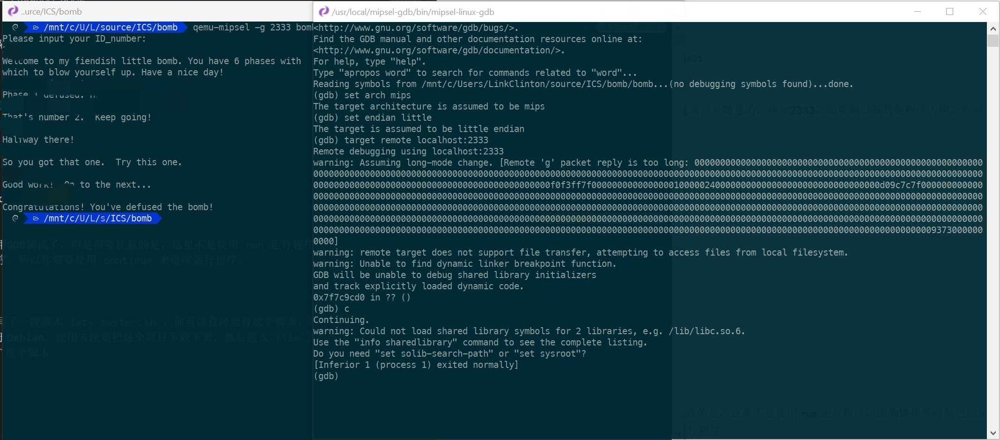

# Qemu-User-Installation-Tutorial

由于`Qemu`自己官方的文档太少，以及`GDB`链接到User模式下的`Qemu`非常的坑。

因此这里记录下User模式的简单安装以及对应`GDB`的使用。这里以一个基于mips指令集的C程序为例。

## Install WSL

Windows用户推荐使用`WSL`(Windows Subsystem for Linux)来运行qemu，因为只有Linux和FreeBSD支持User模式。如果是Linux用户那么就可以不管这些。

这里我使用的是Debian，如果是其他发行版本的Linux，会有一些不同，尤其是可能没有对应的包。

WSL的安装可以自行查找，总而言之很简单。你可以去[官网](https://docs.microsoft.com/zh-cn/windows/wsl/about)看下。

## Install Qemu-User

首先先更新包，然后再安装user模式下的qemu。

```sh
sudo apt-get update
sudo apt-get install qemu-user
```

理论上安装完后就可以直接运行了，但是很多时候程序是使用到了动态库的(如果你用了C标准库，那么你得提供其所需的动态库，如果用到了其他的动态库，那么就得提供对应的mips指令集版本的动态库)。这里假设要运行的是一个普通的使用了C标准库的C程序，我们可以直接安装对应版本的动态库。

```sh
sudo apt-get install libc6-mipsel-cross
```

安装完后，对应的所有的动态库在`/usr/mipsel-linux-gnu`文件夹内，我们在使用qemu的时候需要显式的告诉qemu这个动态库目录(`-L`)。

注意，Ubuntu只有19.0x版本的提供了这个包，其他版本的需要自行想版本下载。例如使用Debian的源，或者手动下载。

### Optional

如果你想偷懒，那么可以使用下面的指令将整个库移动到qemu默认加载的库目录。

```sh
sudo mkdir /etc/qemu-binfmt
sudo ln -s /usr/mipsel-linux-gnu /etc/qemu-binfmt/mipsel
```

### Run

之后你就可以直接使用qemu去模拟mips指令集并且运行mips指令集的程序了。

```sh
qemu-mipsel PROGRAM_NAME PROGRAM_ARGU0 PROGRAM_ARGU1 ...
qemu-mipsel -L /usr/mipsel-linux-gnu PROGRAM_NAME PROGRAM_ARGS
```

- PROGRAM_NAME : 程序的路径以及名字，例如bomb。
- PROGRAM_ARGS : 要传递给程序的参数。

上面有两条指令，分别对应偷懒的和勤奋的玩家，如果进行了可选操作，你可以直接使用第一条，否则是第二条。

## Install GDB

GDB要链接到qemu模拟的程序上，其实并不麻烦。

但是由于一些奇怪的原因，这里是我的猜测。由于qemu在64位的机器上的指令集长度是64位，GDB调试的时候由于调试的指令是mipsel，因此他会认为是32位的指令，但是qemu发送过来的却是64位的，因此导致指令太长，GDB会报错。

因此需要解决这个问题，这也是最为麻烦的地方。

- 尝试使用32位系统，这样运行的qemu是32位的。
- 参照别人的解决方法修改GDB源码并且编译。
- 使用别人编译好的版本的GDB。

第一个就不解释了。

### Optional-0 Compile GDB

要编译GDB，配置有一些麻烦，实际上我也不确定它所需要哪些依赖。因为我使用的是基于Debian的系统，安装的时候很多依赖都已经安装好了。因此这里只列出一些依赖，如果遇到缺少的情况，编译的时候会报错，你可以再去安装。

- camke
- gcc
- libc6

首先获取GDB的源码，由于我找到的[解决方案](https://wiki.osdev.org/QEMU_and_GDB_in_long_mode)只适用于7.11版本的GDB，因此下载的[源码](http://ftp.gnu.org/gnu/gdb/)也是7.11版本的。

这里附上需要修改的文件`remote.c`。**注意，所有的cp指令都没有考虑具体的路径，因此你需要在对应的文件或者文件夹前面加上你存放他们的路径，以便于能够正确复制文件。**

```sh
cp remote.c gdb-7.11/gdb/
```

然后编译，首先是配置编译选项。

```sh
./configure --target=mipsel-linux  --prefix=/usr/local/mipsel-gdb
```

然后是编译

```sh
sudo make
```

最后是安装

```sh
sudo make install
```

如果安装给你报错了，也没关系，只要成功编译了，并且将编译后的文件拷贝到`/usr/local/mipsel-gdb`内即可。

### Optional-1 GDB

你也可以使用已经编译好的版本的GDB，这里我提供一个我编译好的GDB。但是需要注意的是由于我编译的时候使用的libc6是2.9版本的，因此你需要安装libc6-2.9，然而Debian的稳定源并不提供这个版本的libc6，因此你需要换源到，从而能够使用`apt`获取libc6-2.9。

我想了想，会换源的肯定知道怎么换源，因此这里就不具体介绍怎么换了。这里提供了一个`sources.list`文件，直接复制过去就可以了。

```sh
sudo rm /etc/apt/sources.list
sudo cp sources.list /etc/apt/
```

然后就是更新libc6。

```sh
sudo apt-get update
sudo apt-get install libc6
```

最后直接运行提供的GDB即可(`mipsel-gdb/bin/mipsel-linux-gdb`)。

## Link Qemu

最后就是使用GDB调试User模式下运行的程序。这里需要打开两个终端，一个用来运行Qemu，一个用来运行GDB。

### Qemu

```sh
qemu-mipsel -g PORT PROGRAM_NAME PROGRAM_ARGS
```

- `-g` : 表示的是等待GDB的链接。
- `PORT` : 表示GDB要链接的端口，通常来说端口是随意的，例如2333，如果端口被其他程序占用，你可以使用2334，2335等等。

### GDB

如果你想在调试的使用`disassemble`等指令，你就需要加载程序文件。

```sh
mipsel-linux-gdb PROGRAM_NAME
```

然后你需要设置好架构

```sh
set arch mips
set endian little
```

最后链接到Qemu

```sh
target remote localhost:PORT
```

之后就可以正常使用GDB调试了，但是需要注意的是，这里不是使用`run`运行程序，因为链接的时候已经运行了程序。所以你需要使用`continue`来继续运行程序。

## Lazy

如果还想偷懒，我写了一段脚本`lazy-master.sh`，你可以直接运行这个脚本。帮你安装好整个环境。但是只能用于Debian。使用方法是把这个项目下载下来，然后进入`file`目录调用`lazy-master.sh`这个脚本。

## Example

